[](https://nodesource.com/products/nsolid)
# Overview
Lending Club is the world’s largest online credit marketplace for peer to peer lending, facilitating personal loans, business loans, and financing for elective medical procedures. Borrowers access these loans through fast and easy online or mobile interfaces. Investors provide the capital to enable many of the loans in exchange for earning interest. Peer-to-peer (P2P) lending is the practice of lending money to individuals or businesses through online services that match lenders directly with borrowers. Since the P2P lending companies offering these services operate entirely online, they can run with lower overhead and provide the service more cheaply than traditional financial institutions. Thus, lenders often earn higher returns compared to savings and investment products offered by banks, while borrowers can borrow money at lower interest rates, even after the P2P lending company has taken a fee for providing the match-making platform and credit checking the borrower. The interest rates are set by lenders who compete for the lowest rate on the reverse auction model or fixed by the intermediary company based on an analysis of the borrower's credit.

[](https://nodesource.com/products/nsolid)

# Lending Club’s Business Model
The process of an application for a loan to its approval can be explained primarily in three steps:
  - Customers interested in a loan complete a simple application at LendingClub.com.
  - Lending Club leverages online data and technology to quickly assess risk, determine a credit rating and assign appropriate interest rates. Qualified applicants receive offers and can evaluate loan options with no impact to their credit score.
  - Investors ranging from individuals to institutions select loans in which to invest and can earn monthly returns.
---
# Goal of the project
We will present and explore the data provided by LC. This data was made available to us after the creation of an investor account. The data consists in 4 files updated every quarter on the same day as the quarterly results of the company are released. They contain information on almost all the loans issued by LC. The only loans missing from these files are the few loans where LC was not authorized to release publicly the details of the transactions.
The information available for each loan consists of all the details of the loans at the time of their issuance as well as more information relative to the latest status of loan such as how much principal has been paid so far, how much interest, if the loan was fully paid or defaulted, or if the borrower is late on payments etc.

* **Data Download** - [Data-download Notebook](https://github.com/sumit91188/deo_sumit_spring2017/blob/master/Final/Data%20Download.ipynb) describes the step by step implementation of downloading the dataset provided on the website by the Loan Lending club.
* **Store Data** - [Data-storage-LoanData Notebook](https://github.com/sumit91188/deo_sumit_spring2017/blob/master/Final/Data%20Download.ipynb) & [Data-Storage-DeclinedLoanData Notebook](https://github.com/sumit91188/deo_sumit_spring2017/blob/master/Final/Data-Storage-DeclinedLoanData.ipynb) describe the step by step process to clean and consolidate all the downloaded files into files per quarter.
* **Analysis 1** - [ana_1 Notebook](https://github.com/sumit91188/deo_sumit_spring2017/blob/master/Final/analysis/ana_1.ipynb) performs Exploratory data analysis on Approved loans vs Declined loans from year 2007 to 2016.
* **Analysis 2** - [ana_2 Notebook](https://github.com/sumit91188/deo_sumit_spring2017/blob/master/Final/analysis/ana_2.ipynb) explores and discovers of the predictive strength of each feature.
* **Analysis 3** - [ana_3 Notebook](https://github.com/sumit91188/deo_sumit_spring2017/blob/master/Final/analysis/ana_3.ipynb) explores the relationship of variables to late payment.
---
## Data Download
### Installation
[Data-download Notebook](https://github.com/sumit91188/deo_sumit_spring2017/blob/master/Final/Data%20Download.ipynb) has following dependency.
```sh
$ pip install MechanicalSoup
$ pip install beautifulsoup4
```
### Get login credentials
```
username = input("Lending-club username : ")
password = input("Lending-club password : ")
```
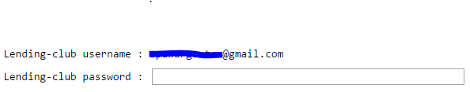

### Loging to the lending-club
```
browser = mechanicalsoup.Browser()
login_page = browser.get(loginURL)
login_form = login_page.soup.find('form', {"id":"member-login"})
login_form.find("input", {"name" : "login_email"})["value"] = username
login_form.find("input", {"name" : "login_password"})["value"] = password
response = browser.submit(login_form, login_page.url)
```

### Check if username & password are correct
```
if (response.url == 'https://www.lendingclub.com/account/summary.action'):
    print(username + " logged in successfully!")
    --download files--
else:
    print("Either username or password or both are wrong..")
```
### Download & unzip files
```
with urlopen(baseURL + extn) as zipresp:
    with ZipFile(BytesIO(zipresp.read())) as zfile:
        zfile.extractall(path)
```
---

## Data Consolidation & Storage
### Installation
[Data-storage-LoanData Notebook](https://github.com/sumit91188/deo_sumit_spring2017/blob/master/Final/Data%20Download.ipynb) & [Data-Storage-DeclinedLoanData Notebook](https://github.com/sumit91188/deo_sumit_spring2017/blob/master/Final/Data-Storage-DeclinedLoanData.ipynb) have following dependency.

```sh
$ pip install pandas
$ pip install numpy
```
### Drop unwanted rows
There are number of unwanted rows which are either empty or contains some junk data. Below figure shows some of such rows.

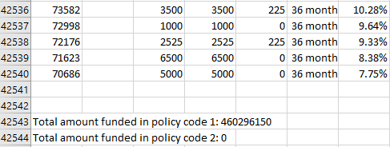

Below function will remove all such rows.
```
def funDropRows(df):
    df.dropna(thresh = 2, inplace = True)
    return df
```
### Select required columns
Below function will select only the columns which will be used for an analysis.
```
def funDropColumns(df):
    selected_colums = list of columns to be selected
    df = df[selected_colums]
    return df
```

### Clean Data
In the columns int_rate, term & emp_length contains some noise data, which is need to be removed. Below rows are some of such examples.

> Loan Data

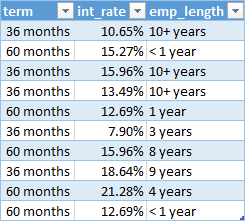

Below function will clean all such columns.
```
def funCleanData(df):
    df['term'] = (df['term'].str.extract('(\d+)')).astype(int)

    df['emp_length'] = df['emp_length'].str.extract('(\d+)')
    df['emp_length'] = df['emp_length'].fillna(0).astype(int)

    df['int_rate'] = df['int_rate'].apply(lambda x: float(x.rstrip("%")))

    return df
```

> Declined-Loan Data

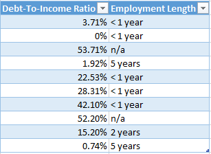

Below function will clean all such columns.
```
def funCleanData(df):

    df['Employment Length'] = df['Employment Length'].str.extract('(\d+)')
    df['Employment Length'] = df['Employment Length'].fillna(0).astype(int)

    df['Debt-To-Income Ratio'] = df['Debt-To-Income Ratio'].apply(lambda x: float(x.rstrip("%")))

    return df
```

### Fill missing data
Below function will fill all the NaNs with some default values.
> Loan Data

```
def funFillMissingData(df):
    df['home_ownership'] = df['home_ownership'].fillna('ANY')
    df['emp_title'] = df['emp_title'].fillna('Unknown')
    df['purpose'] = df['purpose'].fillna('other')
    df['inq_last_6mths'] = (df['inq_last_6mths'].fillna(0)).astype(int)
    df['loan_status'] = df['loan_status'].fillna('other')

    df['verification_status'] = np.where(df['verification_status'] == 'Not Verified' , 'Not Verified', 'Verified')

    return df
```
> Declined-Loan Data

```
def funFillMissingData(df):
    df['Loan Title'] = df['Loan Title'].fillna('Unknown')

    df['Risk_Score'] = df['Risk_Score'].fillna(111).astype(int)
    df['Risk_Score'].replace(0, 111,inplace=True)

    return df
```
### Write data to CSVs in chunks
```
def chunker(seq, size):
    return (seq[pos:pos + size] for pos in range(0, len(seq), size))
```
### Snapshot of cleaned data
> Loan Data

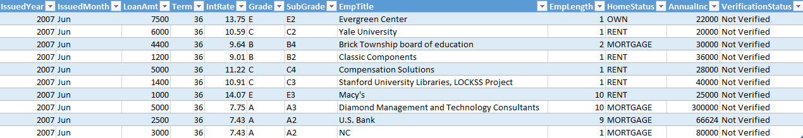

> Declined-Loan Data

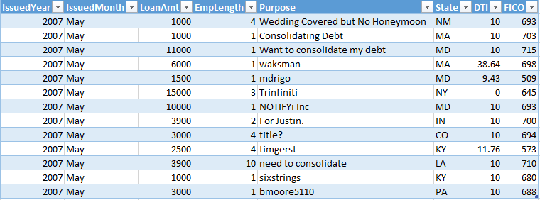

### Snapshot of processed data folder
> Loan Data

The data will be divided in to the four quarters of the year and will be saved as 'year-Quarter.CSV'.

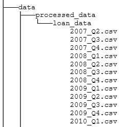

> Declined-Loan Data

The data will be divided in to the four quarters of the year and will be saved as 'year-Quarter.CSV'.

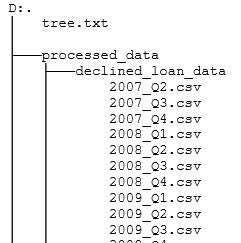

---

## Analysis 1

Exploratory data analysis on Approved vs Declined loans from year 2006 to 2016.

### Installation
[ana_1 Notebook](https://github.com/sumit91188/deo_sumit_spring2017/blob/master/Final/analysis/ana_1.ipynb) has following dependency.

```sh
$ pip install pandas
$ pip install numpy
$ pip install seaborn
$ pip install plotly
```
### Consolidate the data into single data frame
Below code will read each of the accepted/declined loans CSVs and consolidate the whole data into a data frame.

> Loan Data

```
dfLoanData = pd.DataFrame()
for directory, subdirectory, filenames in  os.walk(dataDir + 'loan_data\\'):
    for filename in filenames:
        df = pd.read_csv(os.path.join(directory, filename), encoding = 'ISO-8859-1')
        dfLoanData =  pd.concat([df, dfLoanData], ignore_index=True)
```
> Declined-Loan Data

```
dfDecLoanData = pd.DataFrame()
for directory, subdirectory, filenames in  os.walk(dataDir + 'declined_loan_data\\'):
    for filename in filenames:
        df = pd.read_csv(os.path.join(directory, filename), encoding = 'ISO-8859-1')
        dfDecLoanData =  pd.concat([df, dfLoanData], ignore_index=True)
```

### Summarizing data by States
  - Summary of accepted and rejected loans are displayed on the plot using plotly in offline mode.
  - Group the data by State and take average/mode of the required columns.
  - Create a dictionary of the summary and display on the plotly plot.
  - Hover over each state to get the summary.

> Accepted-Loans Summary

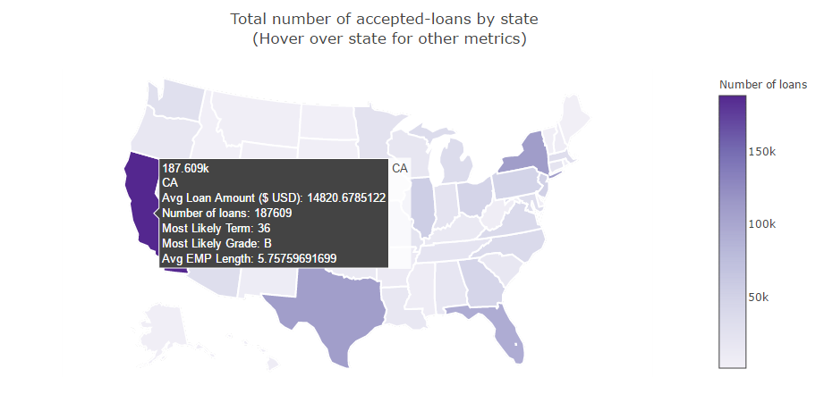

> Declined-Loans Summary

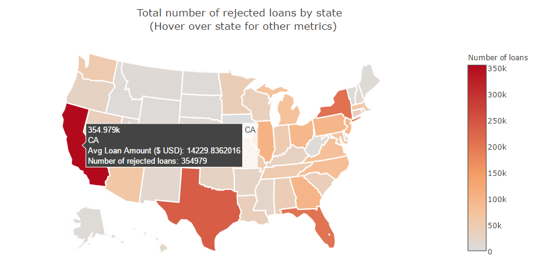

### Time-Series analysis of number of loans
> Loan Data Summary

```
seriesCount = dfLoanData['LoanAmt'].groupby(dfLoanData['IssuedYear']).count()
seriesLA = dfLoanData['LoanAmt'].groupby(dfLoanData['IssuedYear']).mean()

columns=['Year', 'Accepted Loans', 'Avg Loan Amount']
dfAcceptedSummary = pd.DataFrame({'Year':seriesCount.index,'Accepted Loans': seriesCount/1000,
                          'Avg Loan Amount':seriesLA})
```
> Declined-Loan Data Summary

```
seriesCount = dfDecLoanData['LoanAmt'].groupby(dfDecLoanData['IssuedYear']).count()
seriesLA = dfDecLoanData['LoanAmt'].groupby(dfDecLoanData['IssuedYear']).mean()

columns=['Year', 'Declined Loans', 'Avg Dec-Loan Amount']
dfDeclinedSummary = pd.DataFrame({'Year':seriesCount.index,'Declined Loans': seriesCount/1000,
                          'Avg Dec-Loan Amount':seriesLA})
```
> Join above to summaries by year

```
dfSummary = pd.merge(dfAcceptedSummary, dfDeclinedSummary, on='Year')
```

>Below graph supports the fact that in Year 2014, Lending Club went public and started providing loans to small businesses. It also partnered with Union Bank and in the end of 2014, Lending club raised $900 million which we can see with the spike in the number of applications.

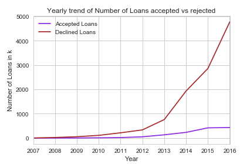

### Time-Series analysis of average loan amount
> Rename columns

```
columns = ['Number Of Loans', 'Avg Loan Amount', 'Year']
dfAcceptedSummary.rename(columns={'Accepted Loans': 'Number Of Loans', 'Avg Loan Amount': 'Avg Loan Amount'}, inplace=True)
dfDeclinedSummary.rename(columns={'Declined Loans': 'Number Of Loans', 'Avg Dec-Loan Amount': 'Avg Loan Amount'}, inplace=True)
dfAcceptedSummary['Flag'] = 'Approved'
dfDeclinedSummary['Flag'] = 'Declined'
```

> Concat two data frames

```
dfSummary = pd.concat([dfAcceptedSummary, dfDeclinedSummary])
```

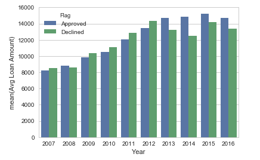

---

## Analysis 2

Exploration and discovery of the predictive strength of each feature.

### Installation
[ana_2 Notebook](https://github.com/sumit91188/deo_sumit_spring2017/blob/master/Final/analysis/ana_2.ipynb) has following dependency.

```sh
$ pip install pandas
$ pip install numpy
$ pip install seaborn
$ pip install plotly
$ pip install cufflinks --upgrade
```

### Create bins based on the FICO scores
>Below is a credit score range chart that shows the different categories and their ranges. Keep in mind that every creditor defines its own ranges for excellent, good, fair, poor and bad credit.

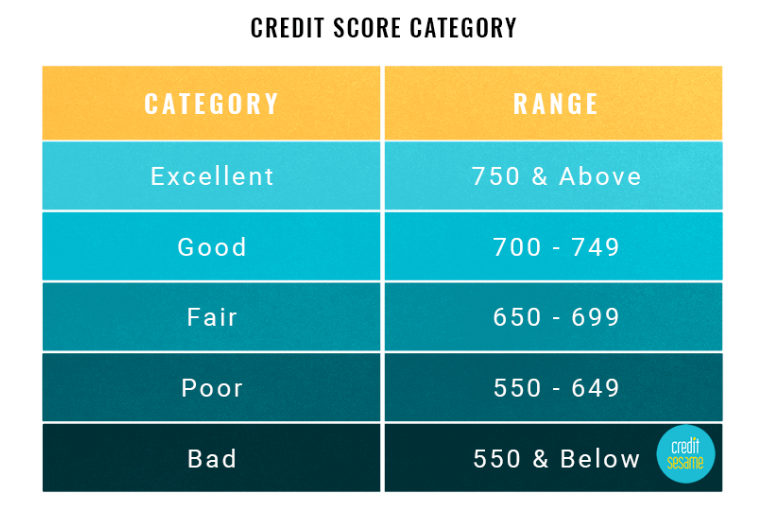

Code to bin the FICO scores into above mentioned categories.
```
bins = [301, 550, 649, 699, 749, 850]
groupNames = ['Bad', 'Poor', 'Fair', 'Good', 'Excellent']

categories = pd.cut(pd.to_numeric(dfLoanData['FICO'], errors='coerce'), bins, labels=groupNames)
dfLoanData['FICOCategory'] = pd.cut(pd.to_numeric(dfLoanData['FICO'], errors='coerce'), bins, labels=groupNames)
```

### Create bins based on the Loan amount & Annual Income
>While binning on the basis of Loan amount/Annual Income, it was found that there are higher frequencies in the some of
 the bins and fewer in the rest.

>Hence I used 'qcut', so that the bins will be chosen in such a way that the same number of records in each bin.

Code to bin the Annual Income/Loan amount.
```
dfLoanData['LoanAmtCat'] = (pd.qcut(dfLoanData['LoanAmt'], 5)).astype(str)
dfLoanData['LoanAmtCat'] = dfLoanData['LoanAmtCat'].map(lambda x: x.lstrip('(').rstrip(']').lstrip('['))

dfLoanData['AnnualIncCat'] = (pd.qcut(dfLoanData['AnnualInc'], 5)).astype(str)
dfLoanData['AnnualIncCat'] = dfLoanData['AnnualIncCat'].map(lambda x: x.lstrip('(').rstrip(']').lstrip('['))
```

### Loan Issued Grouped By FICO

```
seriesCount = dfLoanData['LoanAmt'].groupby(dfLoanData['FICOCategory']).count()

columns=['FICOCategory', 'Count']
dfSummary = pd.DataFrame({'FICOCategory':seriesCount.index,'Count': seriesCount})
dfSummary['FICOCategory'] = dfSummary['FICOCategory'].astype(object)
```

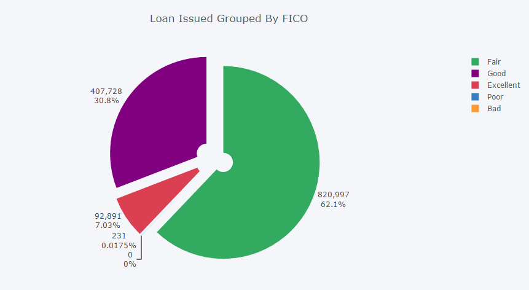

### Loan Issued Grouped By Grade

```
seriesCount = dfLoanData['LoanAmt'].groupby(dfLoanData['Grade']).count()

columns=['Grade', 'Count']
dfSummary = pd.DataFrame({'Grade':seriesCount.index,'Count': seriesCount})
dfSummary['Grade'] = dfSummary['Grade'].astype(object)
```

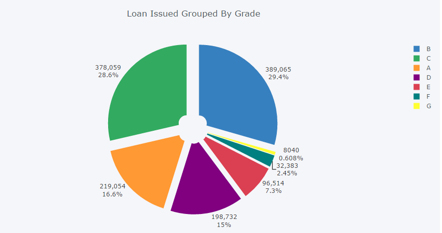

### Exploration of the relationship between FICO and LC scores
>FICO scores have been implemented to assess the credit worthiness of potential borrowers. A model that Lending Club could have used could have been to simply rely on the foundation of FICO’s scores. The majority of the mortgage industry relies on FICO scores to issue mortgages of 100s of thousands.

>Hence our interest in looking into LC’s grade system and more specifically if they have an obvious linear relationship with FICO scores.

```
seriesCount = dfLoanData['FICO'].groupby(dfLoanData['Grade']).mean()

columns=['Grade', 'AvgFICO']
dfSummary = pd.DataFrame({'Grade':seriesCount.index,'AvgFICO': seriesCount})
dfSummary['Grade'] = dfSummary['Grade'].astype(object)
dfSummary['AvgFICO'] = (dfSummary['AvgFICO'].apply(np.floor)).astype(int)

ax1 = sns.boxplot(x = 'Grade', y = 'AvgFICO', data = dfSummary)
```

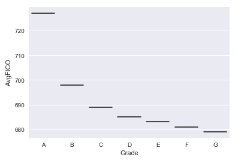

### Summarize & analyze data by year
>To perform the year wise analysis on the loan data, we have Summarized the data as follows.

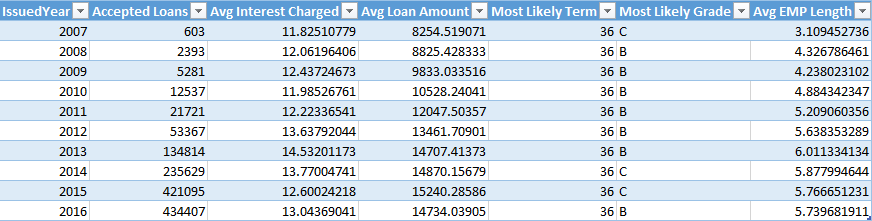

#### Interest Rates at Lending Club since SEC Approval
>Lending Club largely kept their rate the same in 2010 and mid-2011. But they began to shake things up in late-2011, dramatically increasing rates until 2013 to increase investor demand. Since this point, it has been nothing but a consistent reduction in the overall rate as their needs switched to enticing more borrowers. [Click here](http://www.lendingmemo.com/average-investor-return-lending-club-dropping/) to know more..

RENAUD LAPLANCHE, CEO OF LENDING CLUB suggested following in an interview.
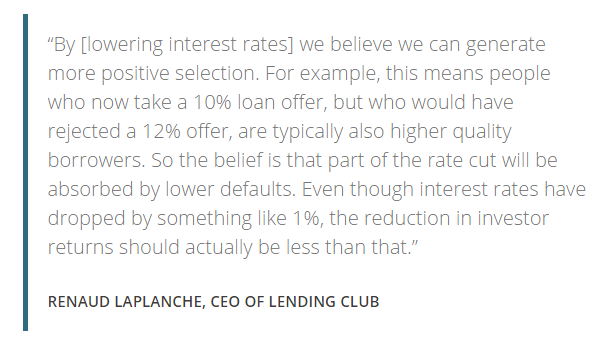

>Below analysis  proves the point Ranaud is making above.

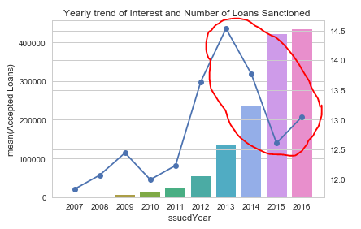

>Comparing 2013 vs 2014 Interest Rates

>A-grade rates have dropped 0.7%

>B-grade rates have dropped 2%

>C-grade rates have dropped 4%

>D-grade rates have dropped 1.9%

>E-grade rates have dropped 1.9%

>But F/G-grade rates have increased 0.8%


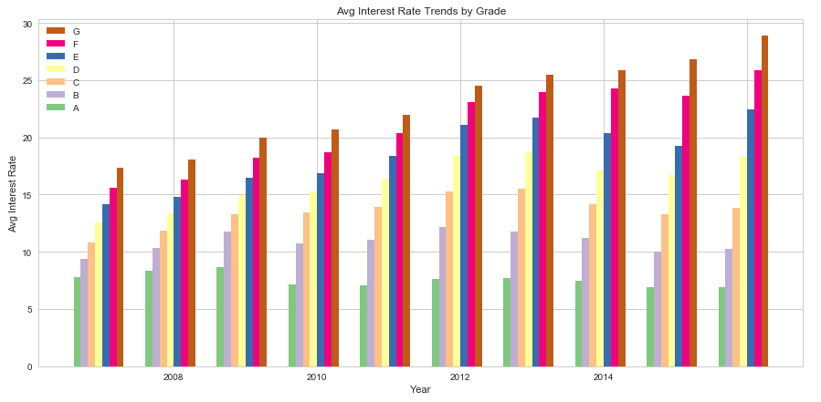

#### Year Wise Accepted Data and Amt_requsted


#### Year Wise Accepted Data and Average Employment Length


### Summarize & analyze data by Grade and Year
>Loan Issued Volume Trends by Grade

>

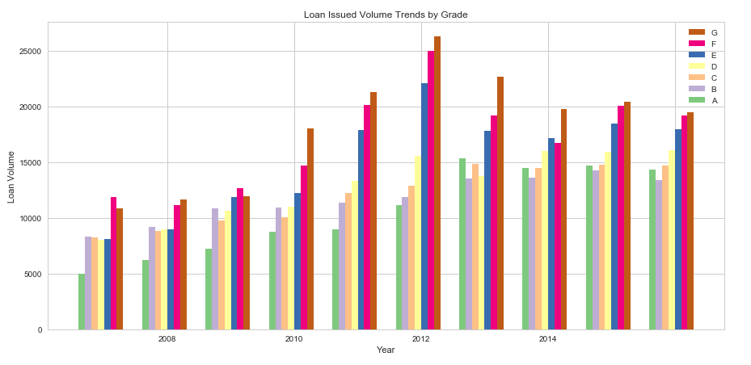

---

## Analysis 3

Exploring the relationship of variables to late payment.

### Installation
[ana_3 Notebook](https://github.com/sumit91188/deo_sumit_spring2017/blob/master/Final/analysis/ana_3.ipynb) has following dependency.

```sh
$ pip install pandas
$ pip install numpy
$ pip install seaborn
$ pip install plotly
```
### Consolidate the data into single data frame
Below code will read each of the accepted/declined loans CSVs and consolidate the whole data into a data frame.
```
dfLoanData = pd.DataFrame()
for directory, subdirectory, filenames in  os.walk(dataDir + 'loan_data\\'):
    for filename in filenames:
        df = pd.read_csv(os.path.join(directory, filename), encoding = 'ISO-8859-1')
        dfLoanData =  pd.concat([df, dfLoanData], ignore_index=True)
```

### Count number of good loans & defaulted loans

```
numberOfDefaults = len(dfLoanData[dfLoanData['DefaultStatus'] == 'Defaulted-Loan'])
numberOfNonDefaults = len(dfLoanData[dfLoanData['DefaultStatus'] == 'Good-Loan'])
```
### Does grade of the loan correlate to whether a loan will be defaulted or not?
```
sns.barplot(x='Grade', y='LoanAmt', data=dfLoanData,
            estimator=lambda x: len(x) / (numberOfNonDefaults + numberOfDefaults) * 100,
            ax=ax1, order=sorted(dfLoanData['Grade'].unique()), palette='deep')
sns.barplot(x='Grade', y='LoanAmt', data=dfLoanData[dfLoanData['DefaultStatus'] == 'Good-Loan'],
            estimator=lambda x: len(x) / numberOfNonDefaults * 100,
            ax=ax2, order=sorted(dfLoanData['Grade'].unique()), palette='deep')
sns.barplot(x='Grade', y='LoanAmt', data=dfLoanData[dfLoanData['DefaultStatus'] == 'Defaulted-Loan'],
            estimator=lambda x: len(x) / numberOfDefaults * 100,
            ax=ax3, order=sorted(dfLoanData['Grade'].unique()), palette='deep')
```

>The grade of the loan is the companies estimate of the likelihood of default for the loan. As should probably be expected the best graded loans (A and B) have a higher percentage of loans with no default than with a default. C is approximately the same percentage across no default and default and the worst graded loans (D, E, F and G) have a higher percentage of loans with default than with no default.

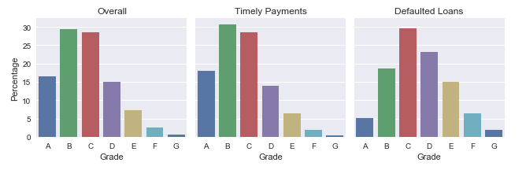

### Does loan term correlate to whether a loan will be defaulted or not?
```
sns.barplot(x='Term', y='LoanAmt', data=dfLoanData,
            estimator=lambda x: len(x) / (numberOfNonDefaults + numberOfDefaults) * 100,
            ax=ax1, order=sorted(dfLoanData['Term'].unique()), palette='deep')
sns.barplot(x='Term', y='LoanAmt', data=dfLoanData[dfLoanData['DefaultStatus'] == 'Good-Loan'],
            estimator=lambda x: len(x) / numberOfNonDefaults * 100,
            ax=ax2, order=sorted(dfLoanData['Term'].unique()), palette='deep')
sns.barplot(x='Term', y='LoanAmt', data=dfLoanData[dfLoanData['DefaultStatus'] == 'Defaulted-Loan'],
            estimator=lambda x: len(x) / numberOfDefaults * 100,
            ax=ax3, order=sorted(dfLoanData['Term'].unique()), palette='deep')
```

>The longer term loans (60 months) make up a higher percentage of the defaults than the non defaulting loans.

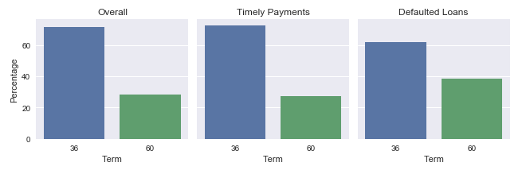

### Does Rate of Interest correlate to whether a loan will be defaulted or not?
```
ax1 = sns.boxplot(x='DefaultStatus', y='IntRate', data=dfLoanData)
```

>The defaulting loans have a higher interest rate than non defaulting loans.

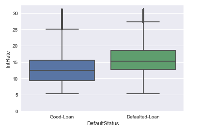

### Does combination of ROI & Grade correlate to whether a loan will be defaulted or not?
```
ax1 = sns.boxplot(x='Grade', y='IntRate', data=dfLoanData, hue='DefaultStatus',
                     order=sorted(dfLoanData['Grade'].unique()))
```

>Even controlling for the grade of the loan (as this will be used to calculate the interest rate) the defaulting loans still have a higher interest rate than non defaulting loans until you get to grades F and G.

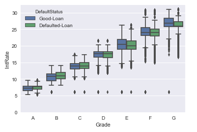

### Does DTI correlate to whether a loan will be defaulted or not?
```
ax1 = sns.boxplot(x='DefaultStatus', y='DTI', data=dfLoanData)
```

>Defaulting loans have a higher DTI.

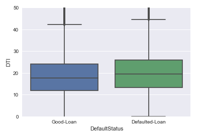

### Does CreditHistory correlate to whether a loan will be defaulted or not?
```
ax1 = sns.boxplot(x='DefaultStatus', y='CreditHistory', data=dfLoanData)
```

>Good loans have comparatively longer Credit History.

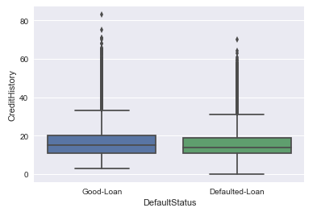

### Summarizing data by States
  - Summary of accepted and rejected loans are displayed on the plot using plotly in offline mode.
  - Group the data by State and take average/mode of the required columns.
  - Create a dictionary of the summary and display on the plotly plot.
  - Hover over each state to get the summary.

> Divide data frame into two, each of good loans & defaulted loans

```
df1 = dfLoanData[dfLoanData['DefaultStatus'] == 'Good-Loan']
df2 = dfLoanData[dfLoanData['DefaultStatus'] == 'Defaulted-Loan']
```
> Good-Loans Summary

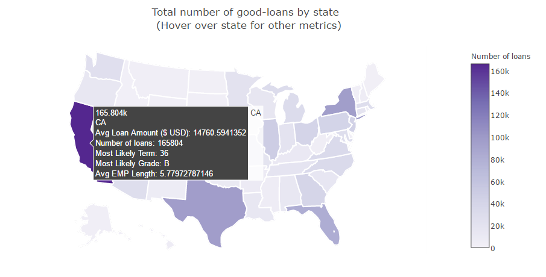

> Defaulted-Loans Summary

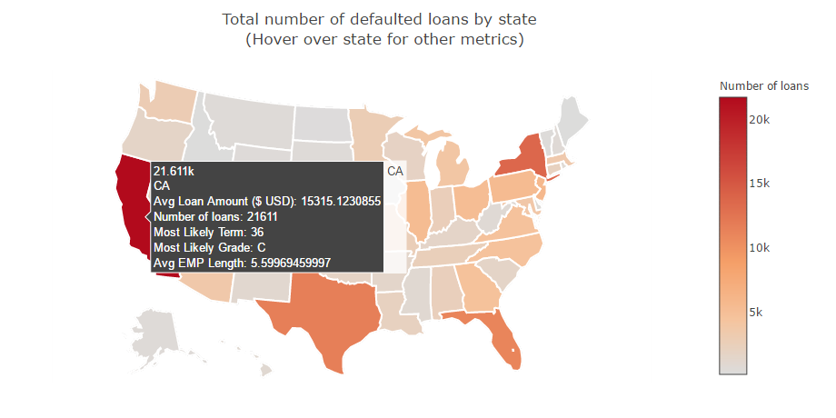
