# Mid term submission - Python

Question 1 : Enron Data analysis
Question 2 : NYT Api data analysis

## Getting Started

These instructions will get you a copy of the project up and running on your local machine for development and testing purposes. See deployment for notes on how to deploy the project on a live system.

### Prerequisites

What things you need to install the software and how to install them

```
pip install word cloud
pip install nltk

```


## Question 1 : Analyzing the Enron Email Corpus

This python file analyses some of the Enron Email Corpus. It has 3 notebooks, each containing a graph
displaying how different persons are connected through emails present in the corpus.

The Enron Email Corpus can be downloaded from http://www.cs.cmu.edu/~enron/ and the contents
should be untared in the same directory as the notebooks, producing a folder named 'data'.

The python notebook itself contains more comments with details on each step in the analysis.

### Data selection

*Only emails from 'Sent' or 'Sent_Items' folders are analysed.*

This greatly reduces the number of emails. 'Sent' folders will not contain spam and will only
contain email sent on purpose by an Enron employee, making it uncessary to filter emails for
validity. 'Sent' folders will furthermore not contain duplicates (i.e. an email in the 'Sent'
folder of one person will be present in the inbox of another person, but not in any other
'Sent' folder), relieving us of the work of identifying such duplicates and removing them.


### Analysis1: 1-1 Mails sent between people whose mailboxes are in the data set

The first analysis looks only at emails that are sent between people whose mailbox is in the data set.
To do that, only emails are kept that are sent to someone that has also sent a mail him/herself.

When analyzing the fraud in such a big company, it is important to look into the emails exchanged 1-1.
In the notebook top 15 exchanges have been displayed, but complete data can be found in ListOf1To1Emails.csv
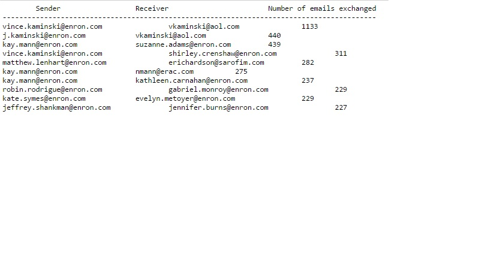
Also, it is equally important to look into the emails exchanged 1-1 to the emails outside the ENRON server.
In the notebook top 15 exchanges have been displayed, but complete data can be found in ListOf1To1OutOfEnronEmail.csv
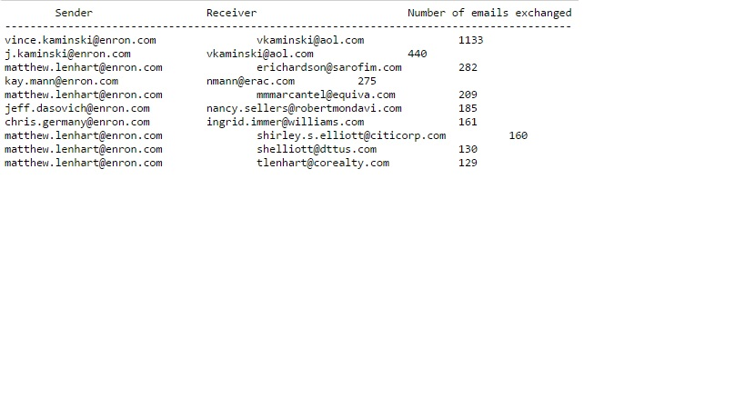
### Analysis2: Analyzing the network trafic of the emails sent from the ENRON.

It is very important to find out the network trafic of the ENRON, We can see the pattern in the increase of the sent email.
1st analysis shows the number of emails sent per year.
As you can see, the number of emails sent has increased marginally in the year 2003 (ENRON scandal year).
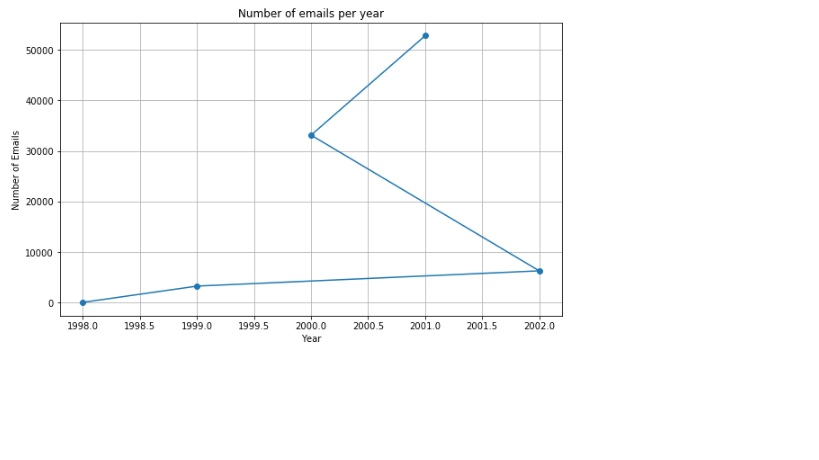
2nd analysis is about the number of emails sent per day.
It was done to check if emails are sent in the weekends also.
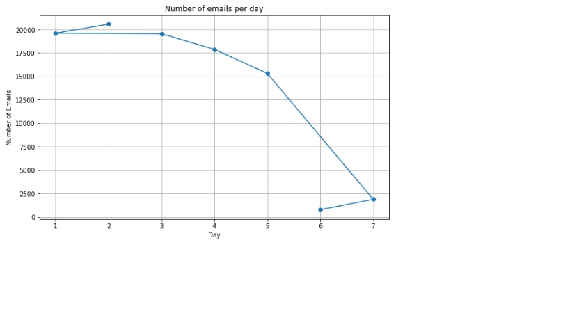
3rd analysis is about the number of emails sent per month.
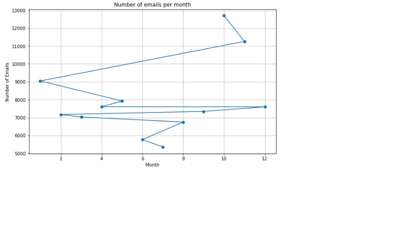

### Analysis3: Analyzing the content of the emails exchanged during the scandal period (2001).

In this analysis I have analysed the contents in the body to check we can get any idea about the scandal.
Below is the analysis of the subject lines used by the ENRON users.
I have used word cloud to display the analysis, also I have  used the lemmitizer to match the similar words.
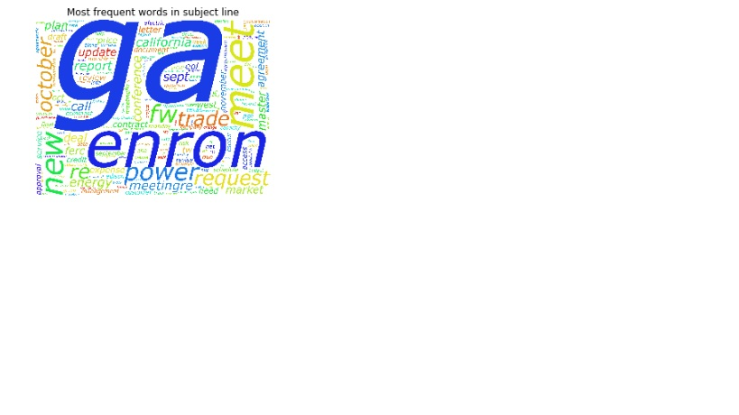
Below is the analysis of the email body used by the ENRON users.
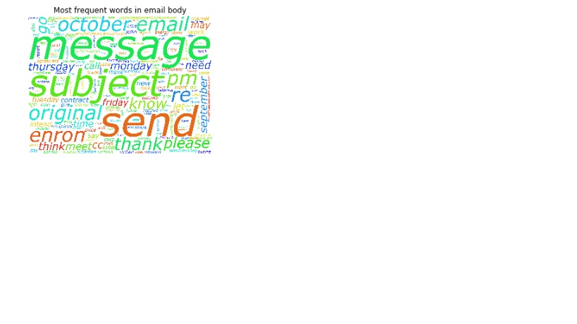

## Question 2 : Analyzing the NYT API

I have used 2 APIs :
	1. Articles
	2. Community

To get the data from the API Ihave created another notebook, which can be parameterized to take the input 
quesries.
e.g date, key, page
All the JSON files will be downloaded and saved as per the date of the article/comment.
Article name will be appended by additional parameter 'page'.
By default NYT allows 101 pagination.
e.g. if an article is updated on 07/02/2017 then its downloaded filename will be
```
article - 20170703.0.json
comment - 20170703.json

```
### Analysis1: Comments analysis for the period during which US election was held.

In this project I have used the comments from July-2016 to December-2016. I have done so, to get all the comments 
and look if people are talking about the US electioon or not.

Below analysis shows top 10 active users.
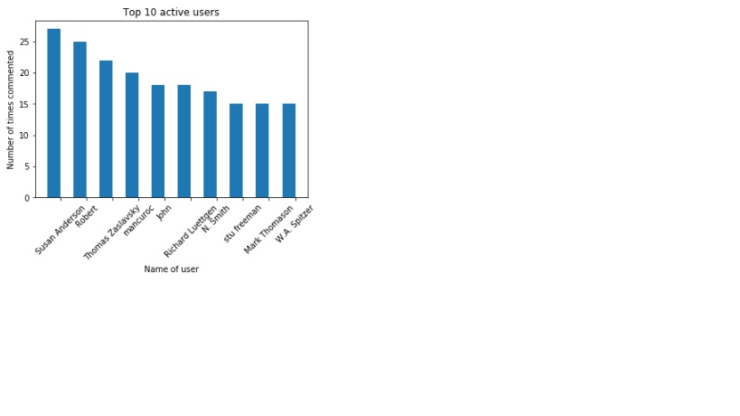
Below analysis shows the topics on which top 10 users have talked. Interestingly, top 10 most discussed topics are 
related to US election.
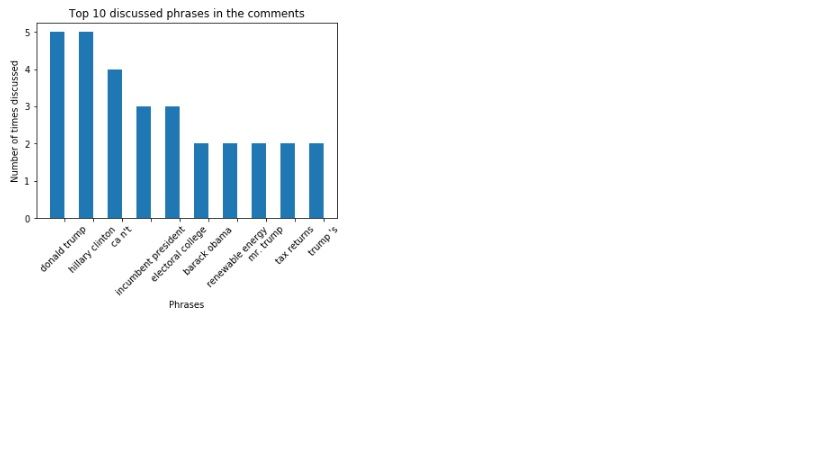
Below analysis shows top 10 active locations from where people have commented.
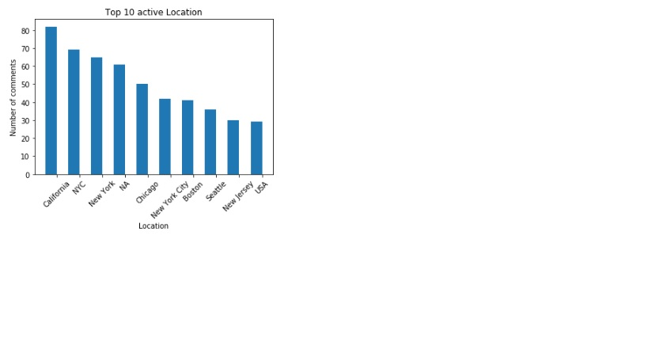
Below analysis shows the topics on which top 10 locations have talked. Interestingly, top 10 most discussed topics are 
related to US election.
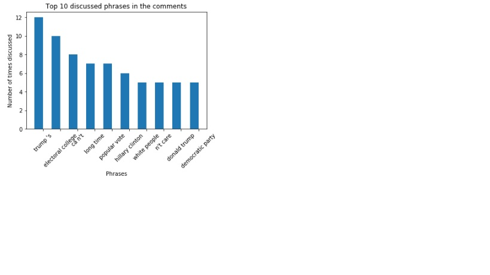

### Analysis2: US Election Analysis

In this project I have used the articles from July-2016 to December-2016. Also I have modified the query,
to get the articles related to the election.
I have used NLTK tokennizer to, get only the NOUNS & ADJ used for both the nominees.

```
"http://api.nytimes.com/svc/search/v2/articlesearch.json?q=Presidential+Election+donald+trump+hillary+clinton&begin_date=" + date + "&end_date=" + date + "&page=" + str(page) + "&api-key=" + api_key

```

Below analysis which shows the distribution of articles between Donald Trump and Hilary Clinton.
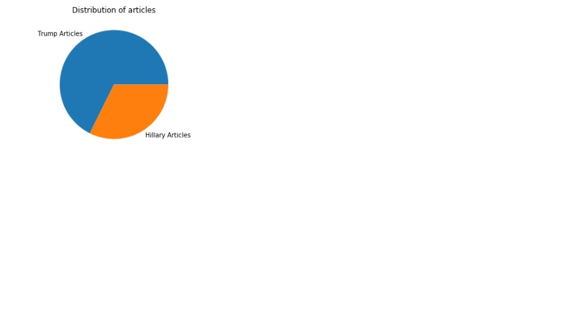
Bewlow are the top 10 phrases talked about Donald Trump.
Top phrases include, 'White house', 'republican party', 'mike pence' which make sense.
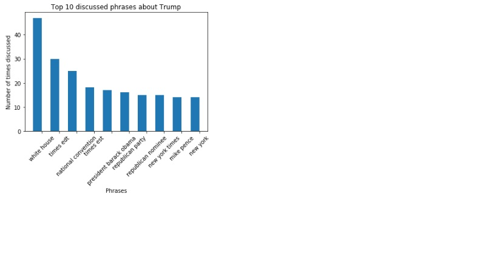
Bewlow are the top 10 phrases talked about Hilary Clinton.
Top phrases include, 'private email server', 'federal bureau', 'criminal charges' which make sense, because shw was in the
news for these topics.
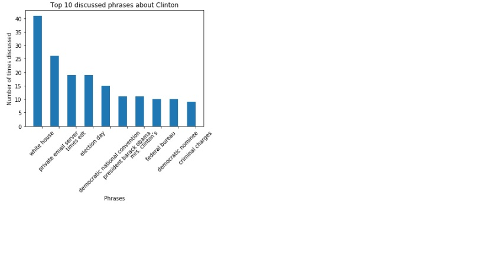

### Analysis3: NYT articles Analysis

In this project I have used the articles from July-2016 to December-2016.

```
"http://api.nytimes.com/svc/search/v2/articlesearch.json?begin_date=" + date + "&end_date=" + date + "&page=" + str(page) + "&api-key=" + api_key

```

In the 1st analysis I have categorized all the articles. From below chart it is visible that we have more 'News' articles.
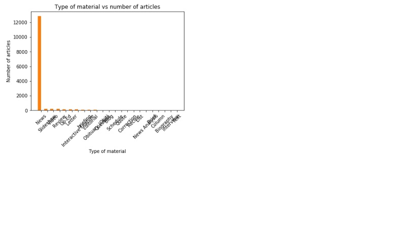
As we have the highest number of articles as 'News', further analysis is done on the 'News' articles.
'News' articles are again drilled down and categorized in the sub-categories.
All the charts are generated dynamically from the sub-categories found.
Top discussed Person
Of course - Donald Trump
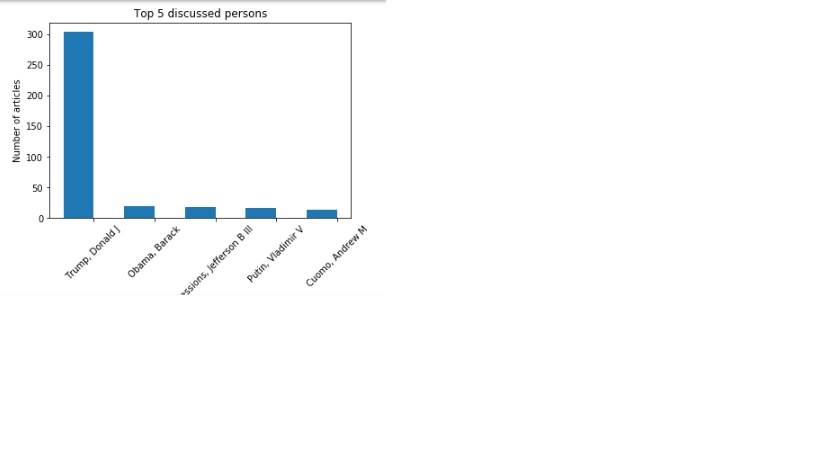
Top discussed Location
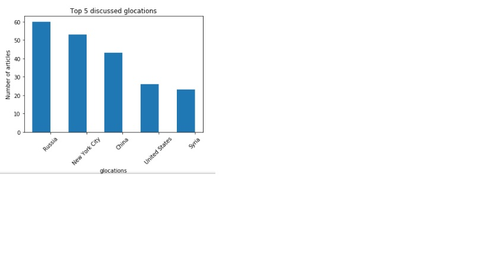
Top discussed Organization
Again - Republican party
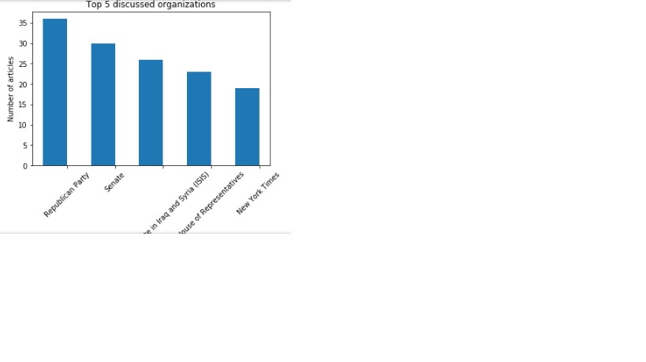
Top discussed Creative work
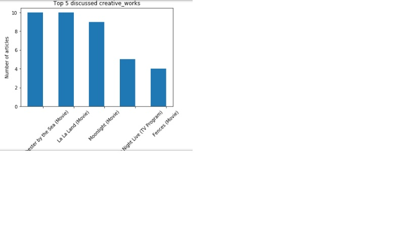
Top discussed Subjects
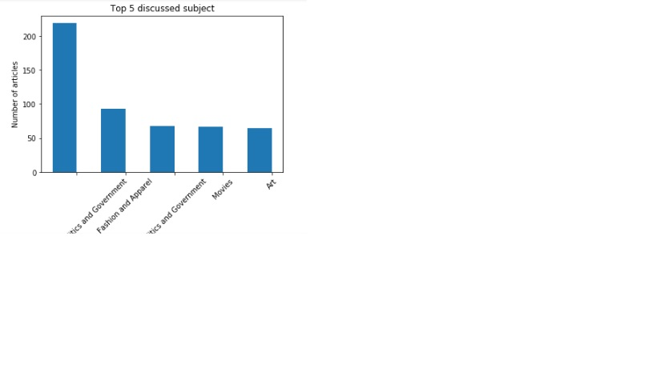
